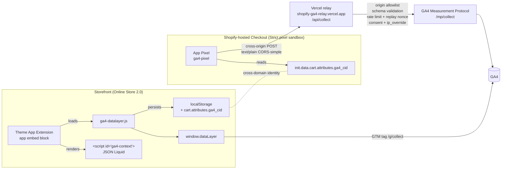

# Architecture

## Data flow



## Components

- **Theme App Extension `ga4-datalayer`** — Liquid block + bundled JS. Initializes dataLayer, parses Liquid context, intercepts cart fetch/XHR, observes variant changes, dispatches per-page events.
- **App Pixel `ga4-pixel`** — Strict sandbox web worker. Subscribes to `checkout_started` / `checkout_completed`, reads `client_id` from cart attributes, POSTs cross-origin (text/plain, CORS-simple) to the Vercel relay. Cross-origin instead of App Proxy because the Strict sandbox throws `RestrictedUrlError` on any fetch to `<shop>.myshopify.com` (where App Proxy URLs live), so the App Proxy path is categorically unreachable from the pixel.
- **Vercel relay `app/routes/api.collect.tsx`** — public endpoint at `shopify-ga4-relay.vercel.app/api/collect`. Validates Origin (CORS allowlist for `*.shopifyapps.com` + `*.myshopify.com`), shop domain pattern, payload schema, applies token-bucket rate limit + replay-nonce guard, forwards to GA4 Measurement Protocol with server-side `api_secret`, `ip_override` from buyer XFF, and the buyer's User-Agent (otherwise GA4's bot filter trips on the datacenter source).
- **App Proxy reference relay `app/routes/apps.ga4-relay.$.tsx`** — kept as a signed-HMAC reference implementation (token-bucket + replay-nonce + HMAC-SHA256 with sorted query params and multi-value comma-join, MCP-verified). Not in the production data path; the docstring at the top of the file explains why.
- **Validation layer** — Zod schema (`src/datalayer/schema.ts`), no-leak `safePush` (`src/datalayer/core.ts`), shadow-DOM debug overlay (`src/debug/overlay.ts`), copy-pastable console snippet (`docs/gtm-debug-snippet.js`).
- **Cross-domain identity** — `client_id` (UUIDv4) generated on first storefront visit, stored in `localStorage` and propagated to checkout via `cart.attributes.ga4_cid`. App Pixel reads it from `init.data.cart.attributes`. No third-party cookie required.

## Module map

```
src/
├── datalayer/
│   ├── schema.ts        # Zod GA4Event/Item/Ecommerce
│   ├── validator.ts     # validate() returns {ok, errors}
│   ├── core.ts          # initDataLayer + safePush (no-leak)
│   └── consent.ts       # Consent Mode v2 wrapper
├── adapters/
│   ├── liquid-context.ts  # parses <script id="ga4-context"> with guards
│   ├── client-id.ts       # UUID gen + cart.attributes propagation
│   ├── cart-api.ts        # fetch+XHR interceptor + sentinel + pendingUserActions
│   └── variant-observer.ts # variant-selects + variant-radios + MutationObserver
├── events/
│   ├── view-item-list.ts  # PLP, indexed items
│   ├── select-item.ts     # PLP click → sessionStorage attribution
│   ├── view-item.ts       # PDP, variant resolution
│   ├── add-to-cart.ts     # /cart/add.js → propagates list attribution
│   ├── remove-from-cart.ts # cart diff, gated by pendingUserActions
│   └── view-cart.ts       # /cart.js → cart payload
├── debug/overlay.ts        # ?ga4_debug=1 shadow-DOM widget
└── entry.ts                # bootstrap pipeline (DOMContentLoaded)

extensions/
├── ga4-datalayer/          # Theme App Extension
│   └── blocks/ga4-embed.liquid  # app embed block, body target
└── ga4-pixel/              # App Pixel (Strict sandbox)
    └── src/index.ts        # subscribes checkout events, POSTs relay

app/                        # Remix admin + relay
├── routes/
│   ├── app._index.tsx       # admin status panel (Polaris)
│   ├── api.collect.tsx      # Vercel relay (active path for the pixel)
│   └── apps.ga4-relay.$.tsx # App Proxy splat route (reference HMAC, kept)
└── lib/
    ├── app-proxy-hmac.ts    # signature verification (used by the App Proxy reference)
    └── rate-limit.ts        # token-bucket (shared by both relays)
```

## Event lifecycle

1. **Page load** → `bootstrap()` in `src/entry.ts`:
   - `initDataLayer()` initializes `window.dataLayer = []`
   - `parseContext()` reads Liquid JSON
   - `applyConsentDefaults()` sets `denied` baseline (Consent Mode v2)
   - `ensureClientId()` + `persistToCart()` propagate `ga4_cid`
   - `injectGTM()` loads GTM script with the merchant-configured Container ID
   - `installCartInterceptor()` patches `fetch` and `XMLHttpRequest`
2. **Page-specific dispatchers**:
   - Collection: `emitViewItemList()` + `bindSelectItem()`
   - Product: `buildViewItem()` (initial + on variant change via `observeVariantChange`)
   - Cart: GET `/cart.js` → `buildViewCart()`
3. **User actions**:
   - Cart additions intercepted via fetch wrapper → `buildAddToCart()`
   - Cart removals diffed and gated by `pendingUserActions` → `buildRemoveFromCart()`
4. **Checkout** (separate sandbox):
   - App Pixel subscribes to `checkout_started` / `checkout_completed`
   - Reads `ga4_cid` from `init.data.cart.attributes`, `customerPrivacy` for consent state
   - POSTs cross-origin to `https://shopify-ga4-relay.vercel.app/api/collect` (text/plain, CORS-simple, `keepalive: true`)
   - Vercel relay validates Origin + shop + schema + rate limit + replay nonce, then forwards to GA4 Measurement Protocol with server-side `api_secret`, buyer `ip_override`, and forwarded User-Agent
